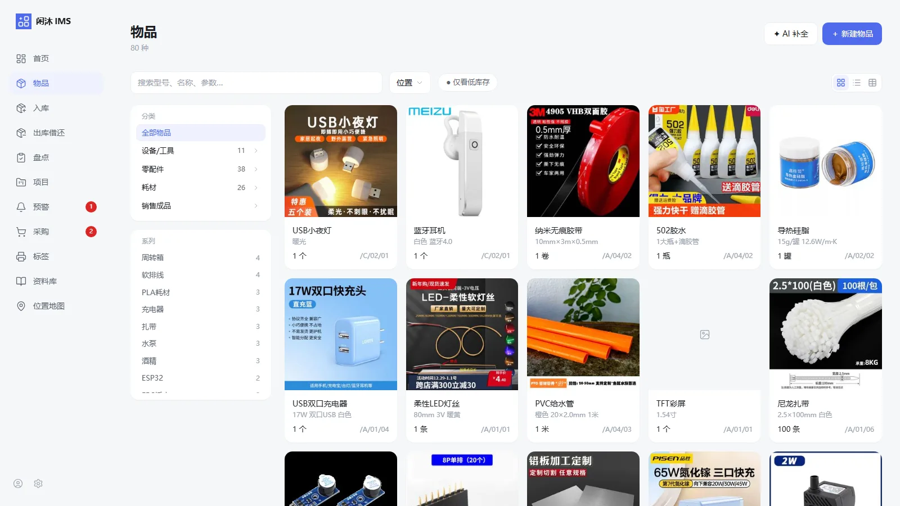
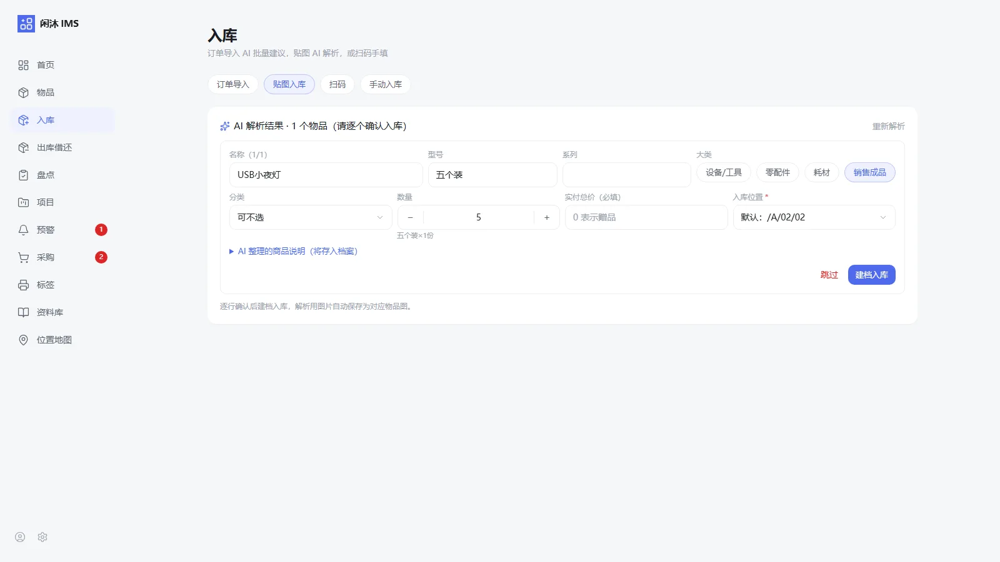
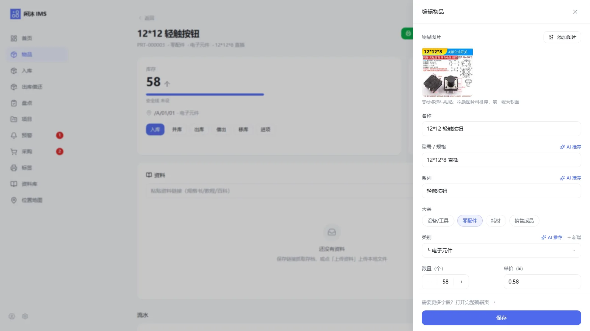
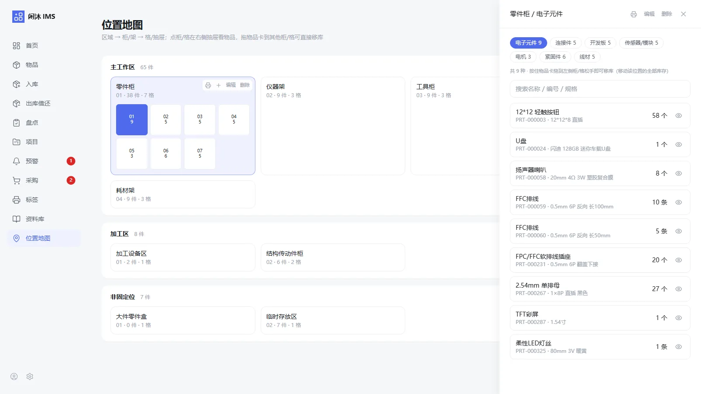
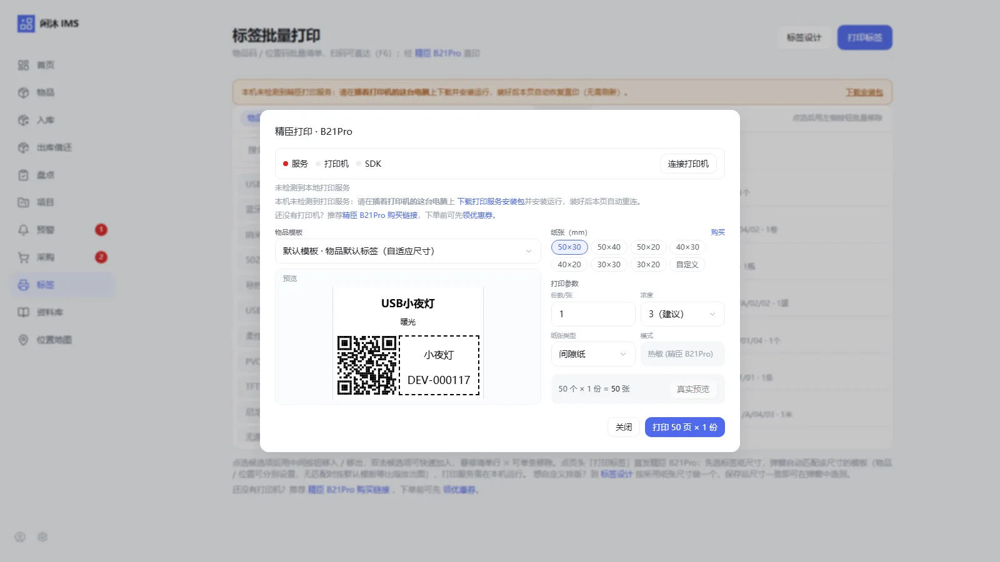
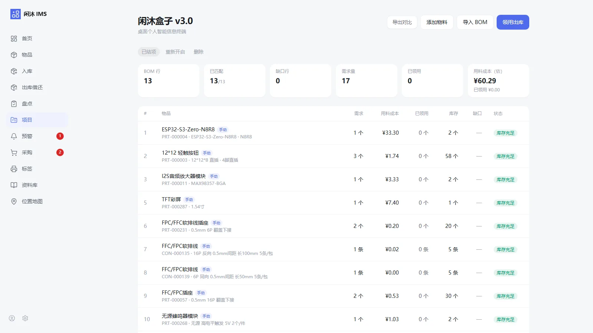
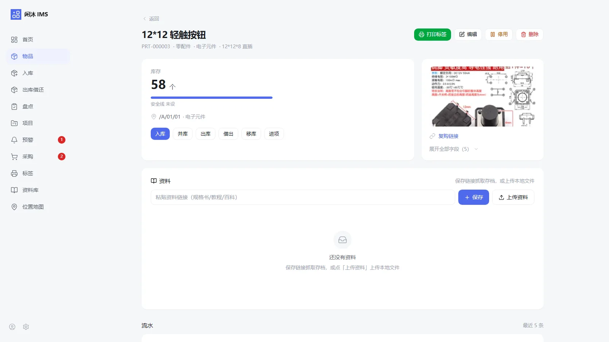

<div align="center">

<picture>
  <source media="(prefers-color-scheme: dark)" srcset="assets/logo-horizontal-dark.png">
  
</picture>

### 跑在自己电脑或 NAS 上的物资管理系统

**1 张截图 = 10 秒入库** · 数据存在自己设备里 · 免费版永久免费

[**下载 Windows 版**](https://github.com/miaokingsoft/XianMuIMS/releases/download/v1.78.0/XianMuIMS-1.78.0-setup.exe) ·
[在线体验](https://imsdemo.miaoking.com) ·
[官网](https://ims.miaoking.com) ·
[全部版本](../../releases)

</div>

---

## 下载

### Windows 安装版

**[⬇ 下载 XianMuIMS-setup.exe](https://github.com/miaokingsoft/XianMuIMS/releases/download/v1.78.0/XianMuIMS-1.78.0-setup.exe)**

- 适用 **Windows 10 / 11 64 位**，双击安装即用，**无需**装 Python / Node / MySQL
- 自带常驻工具箱（服务启停、开机自启、端口管理、数据库切换），**无需管理员权限**
- 下载无需注册、不做邮箱校验；免费版永久免费，不激活也照常使用
- 历史版本与更新说明见 [Releases](../../releases)；官网下载入口：[ims.miaoking.com](https://ims.miaoking.com/#download)

**校验下载完整性（推荐）**：与安装包同目录发布同名 `.sha256` 文件。

```powershell
# Windows PowerShell：把结果与 Releases 页的 .sha256 文件对比，应完全一致
Get-FileHash .\XianMuIMS-setup.exe -Algorithm SHA256
```

> **关于 SmartScreen 提示**：安装包暂未购买代码签名证书，Windows 首次运行可能提示"已保护你的电脑"。这不是病毒告警，而是对"未签名程序"的通用提示——可以点「更多信息 → 仍要运行」，或先用上面的 SHA256 校验确认文件未被篡改。介意的话也可以改用 [NAS / Docker 部署](https://ims.miaoking.com/docs/deploy.html)。

### NAS / Docker 部署

群晖、QNAP 或任意 Docker 环境：一条 `docker compose up` 启动，首次自动建表迁移；数据全在 NAS 自己的数据库里。图文步骤见 [部署指南](https://ims.miaoking.com/docs/deploy.html)。Mac 与 Linux 同样通过 Docker 运行。

---

## 先在线体验

不想先装？**[imsdemo.miaoking.com](https://imsdemo.miaoking.com)** 随时可进，以**专业版全功能**运行（含多人协作 / 开放 API / 审计日志），无需注册。

演示账号 `demo`，密码见演示站公告。演示数据每日凌晨重置，请勿存放真实物品信息。



---

## 它解决什么问题

用 Excel、记事本或脑子记账，通常卡在这四件事上：

| 烦心事 | 闲沐 IMS 怎么做 |
|---|---|
| **重复买** —— 不知道还剩几个 | 库存台账以流水为事实源，低于安全线自动提醒 |
| **找不到** —— 记了名字不知道放哪 | 区域 → 柜 → 格位三级位置地图，中文全文检索秒到 |
| **懒得记** —— 建档太麻烦，录一件要敲半天 | 购物截图丢进去，AI 认出品名/型号/数量/价格，确认即入库 |
| **记了没用** —— 手册、链接、替代型号散在网盘和聊天记录 | 数据手册、购买链接、替代型号候选随物品档案走 |

适合：创客 / 独立开发者（元器件、模块、3D 打印耗材）、小工作室（摄影、模型、手工器材）、实验室与教学（试剂、设备、资料可追溯）、家庭个人（工具、耗材、装饰）。

---

## 核心能力

### 一张截图，10 秒入库

购物截图直接 `Ctrl+V` 粘贴（或手机扫码传图），视觉大模型解析出品名、型号、数量、单价，**一图多物**逐行确认入库——一笔不超过 10 秒。也支持淘宝 / 天猫订单 xlsx 批量导入。



### 物品档案与库存台账

图片、参数、库存、流水一页看全；多图附件拖拽排序，首图即封面；自定义字段想加就加，照样搜得到。



### 位置地图

区域 → 柜 → 格位三级地图，按图索骥；同一物品可分布在多个位置；拖一下物品卡就完成移库。



### 标签打印

适配精臣 B21Pro 热敏标签机直印物品码 / 位置码，贴上即扫、扫码直达；标签长什么样，用拖拽设计器自己排。



### 项目管理与 BOM 缺料

导入项目 BOM，自动比对库存标出缺口（充足 / 部分缺 / 完全缺），缺料一键生成采购单，按行领用出库并统计用料成本。



### 资料库 · 手册 / 购买链接 / 替代型号

每个物品都能挂数据手册 PDF、购买链接（自动抓取存档并生成 AI 整理版）、替代型号候选——找料时不用再翻网盘、书签和聊天记录。



### 还有这些

- **精准查找** —— 中文全文检索（SQLite FTS5 trigram / MySQL 8 FULLTEXT ngram 双引擎），规格参数与自定义字段平铺进检索列，记不住型号也搜得到
- **扫码即达** —— 摄像头扫码 + USB 扫码枪双通道，物品码 / 位置码为 http 深链二维码，手机系统相机直接可扫
- **库存与流水** —— 入库 / 出库 / 消耗 / 借还 / 移库 / 盘点，支持冲正，历史全程可追溯
- **预警与到期提醒** —— 耗材保质期临期、仪器校准到期、低库存、逾期未还，提前提醒你
- **手机扫码传图** —— 桌面端生成二维码，手机扫码进入上传页拍照回传，人不用离开货架
- **盘点** —— 任务 / 实盘录入 / 差异对比，确认后自动生成调整流水
- **AI 批量补全 / AI 取图** —— 老档案一键补齐空缺字段（只填空缺，不覆盖人工填写）；没图的物品让 AI 找候选图手选
- **通知渠道** —— 邮件 / 钉钉 / 企业微信 / Telegram，支持每日与每周摘要
- **PWA 手机端** —— 手机浏览器打开就能用，可像 App 一样装到桌面；静态资源与读接口离线可查
- **备份导出** —— 每日定时自动备份，CSV / Excel / JSON 导入导出
- **部署形态** —— SQLite 单文件零运维，或 MySQL 8（两者任选、切换不迁移数据）

> **AI 能力需自配 API Key（BYOK）**：软件不附带密钥、不额外收费，用量由你自己控制；兼容 OpenAI 协议，也可接本地 Ollama 模型。

---

## 系统要求

| 形态 | 要求 |
|---|---|
| Windows 安装版 | Windows 10 / 11 **64 位**；不需要 Python / Node / 数据库 |
| NAS / Docker | 群晖、QNAP 或任意 Docker 环境（单容器）；Mac / Linux 同路径 |
| 数据库（可选） | 默认 SQLite 单文件；也可选 MySQL 8 |
| 浏览器 | Chrome / Edge / Safari / Firefox 等现代浏览器；手机端走 PWA |
| 标签打印（可选） | 精臣 **B21Pro** 标签机 + 精臣官方 USB 驱动 + 闲沐本机打印服务（仅 Windows） |

---

## 文档与常见问题

| 文档 | 内容 |
|---|---|
| [快速开始](https://ims.miaoking.com/docs/quick-start.html) | 5 分钟跑起来：安装、初始化向导、贴图入库第一件物品 |
| [用户手册](https://ims.miaoking.com/docs/manual.html) | 完整功能详解：入库、盘点、位置地图、标签设计器、资料库、AI 能力 |
| [部署指南](https://ims.miaoking.com/docs/deploy.html) | Docker / 群晖部署、备份恢复与升级全流程 |
| [API 文档](https://ims.miaoking.com/docs/api.html) | 开放接口、Webhook 与智能体接入（专业版） |
| [常见问题 FAQ](https://ims.miaoking.com/faq.html) | 免费版限制、价格与授权、设备绑定与退款、标签打印安装 |

**高频问题**

- **是云端服务吗？** 不是。跑在你自己的电脑或 NAS 上，数据存本地，无云端依赖。
- **免费版有什么限制？** 单人 1 个账号 + 50 件物品条目。注意算的是**条目数**（同一型号算一件），库存数量不限——某个型号库存 500 个也只占 1 件额度。
- **AI 功能要另外付费吗？** 不另外付费，免费版与专业版都含；自配 API Key，用量自己控制。
- **换电脑怎么办？** 门户自助解绑旧设备后重新激活即可，不重复收费（需联网访问一次门户）。

---

## 反馈与支持

- **Bug 与功能建议** → [提交 Issue](../../issues)（附版本号、系统与复现步骤，越具体越好）
- **使用问题** → 先查 [FAQ](https://ims.miaoking.com/faq.html) 与 [用户手册](https://ims.miaoking.com/docs/manual.html)
- **服务 QQ** 7740840 · **邮箱** [kf@wwzu.com](mailto:kf@wwzu.com) · **官网** [ims.miaoking.com](https://ims.miaoking.com)

> 提交 Issue 时**请勿粘贴激活码、License 文件内容、API Token、订单号或任何密钥**——这些属于敏感信息，公开 Issue 会被所有人看到。

---

## 关于本仓库

本仓库是闲沐 IMS 的**官方发布与反馈渠道**，用于提供安装包、更新说明与问题跟踪。

**闲沐 IMS 是闭源商业软件，源代码不公开。** 你可以免费下载、安装并使用免费版；本仓库不提供源码，也不接受源码相关的 Pull Request。这不是"开源项目"——请在依赖它之前确认这一点。

- 安装包 / 更新说明 / 历史版本：[Releases](../../releases)
- 软件许可与使用范围：[LICENSE](LICENSE)
- 安全问题与密钥泄露上报：[SECURITY.md](SECURITY.md)
- 官网与用户中心：[ims.miaoking.com](https://ims.miaoking.com) · [portal](https://ims.miaoking.com/portal/dashboard)

---

<div align="center">

**闲沐 IMS** · 极客AI · 物品管理

[官网](https://ims.miaoking.com) · [在线演示](https://imsdemo.miaoking.com) · [下载最新版](https://github.com/miaokingsoft/XianMuIMS/releases/download/v1.78.0/XianMuIMS-1.78.0-setup.exe) · [Releases](../../releases)

</div>
